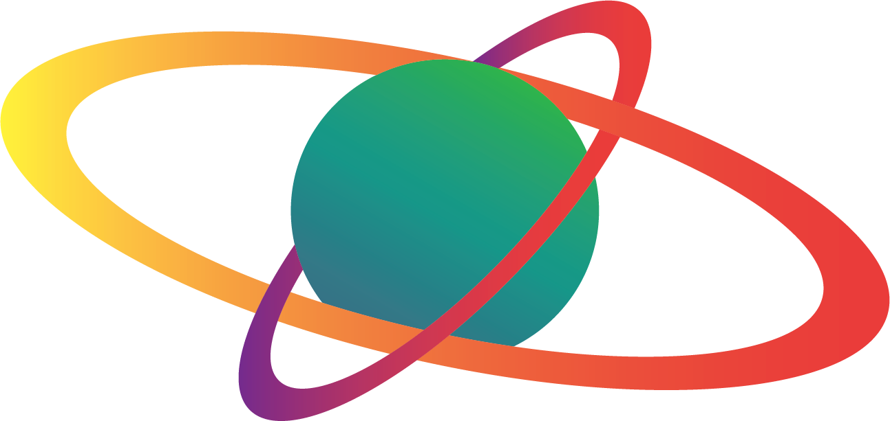

<a name="readme-top">

<br/>

<br />
<div align="center">
  <a href="https://github.com/naivv1/AWD-Seatwork-1-6-BI-25">
    
  </a>
  <h3 align="center">Grade Management System</h3>
</div>
<div align="center">
  A simple webpage that let's you manage student grades.
</div>

<br />


[](https://wakatime.com/badge/user/7f0b295f-8a55-4698-9065-a47b10681ce4/project/56d2b959-480a-4b3a-9646-bc0a35342b1f)
---

<br />
<br />


<details>
  <summary>Table of Contents</summary>
  <ol>
    <li>
      <a href="#overview">Overview</a>
      <ol>
        <li>
          <a href="#key-components">Key Components</a>
        </li>
        <li>
          <a href="#technology">Technology</a>
        </li>
      </ol>
    </li>
    <li>
      <a href="#rule,-practices-and-principles">Rules, Practices and Principles</a>
    </li>
    <li>
      <a href="#resources">Resources</a>
    </li>
  </ol>
</details>

---

## Overview


<!-- The following are just sample -->
This web application allows users to manage student records by adding, displaying, and deleting student information, including their grades for five subjects. The app calculates the Grade Weighted Average (GWA) for each student based on the grades entered for the five subjects.

### Key Components

<!-- The following are just sample -->
Single Page Website: The Grade Management system is a single-page website where users can add, view, and delete student records without navigating away from the page.
Local Storage: Uses browser’s local storage to persist student data across sessions.
Grade Calculation: Automatically calculates the Grade Weighted Average (GWA) for each student based on their subject grades.

### Technology


## Rules, Practices and Principles
1. Always use `WD-` in the front of the Title of the Project for the Subject followed by your custom naming.
2. Do not rename any .html files; always use `index.html` as the filename.
3. Place Files in their respective folders.
4. All file naming are in camel case.
   - Camel case is naming format where there is no white space in separation of each words, the first word is in all lower case while the succeding words first letter are in upper followed by lower cased letters.
   - ex.: buttonAnimatedStyle.css
5. Use only `External CSS`.
6. Renaming of Pages folder names are a must, and relates to what it is doing or data it holding.
7. File Structure to follow below.

```
/grade-management-system
  ├── assets
  │   ├── css
  │   │   └── style.css       # Stylesheet for the webpage
  │   └── js
  │       └── script.js       # JavaScript for managing student records
  ├── index.html              # Home page with general information
  ├── studentrecord.html             # Page for managing student records

## Resources

| Title | Purpose | Link |
|-|-|-|
| CSS Templates |   For CSS and HTML Templates
 |https://www.w3schools.com/w3css/w3css_templates.asp|
